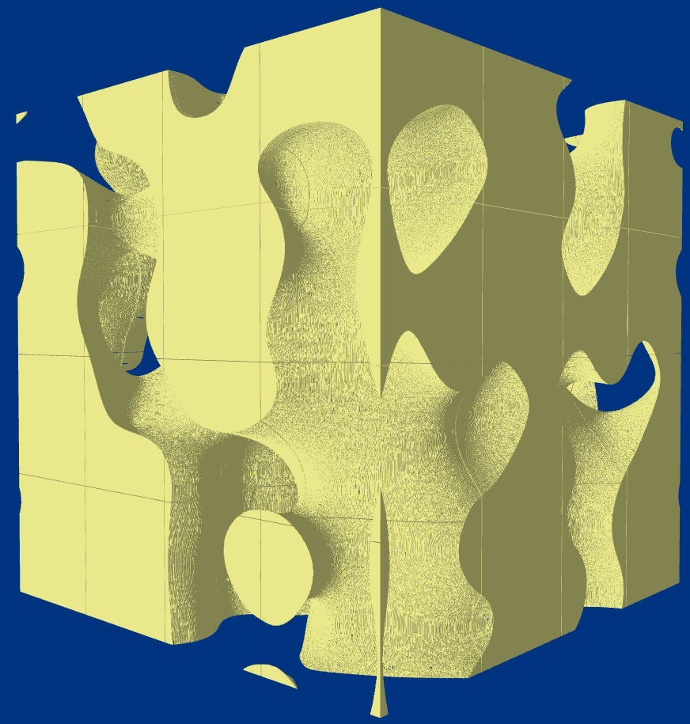

# Voxex

An extremely messy, slightly buggy, and rather slow implementation of sparse voxel terrain, using octrees and n2 algorithms.

Example chunk of 3d perlin noise:

In an unpacked voxel array, a structure this size would use ~2GB. By storing it as type regions instead (combining same-type blocks), the memory required is reduced to only around 22MB (not counting the mesh for rendering, which currently comes out to be much larger).

Of course, this comes at a cost - at the moment, both chunk and mesh generation are pathetically slow. In the future, compute shaders with raytracing may help alleviate this by completely bypassing mesh generation.

---

# Building

For now... good luck.
